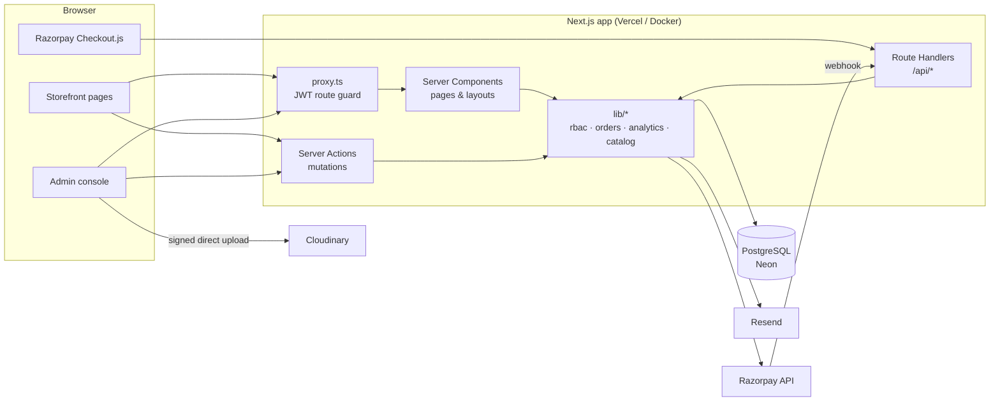

# Architecture

## Overview

Nexus Commerce is a **modular monolith**: one Next.js 16 application contains the storefront, admin console, REST API and background work. Frontend and backend share TypeScript types end-to-end (Prisma → server → React), which removes a whole class of integration bugs while keeping clear internal boundaries.

## Layers

| Layer | Location | Responsibility |
|---|---|---|
| Route guard | `src/proxy.ts`, `src/auth.config.ts` | Fast, database-free JWT check. Redirects anonymous users to `/login` and non-staff away from `/admin`. |
| Pages (read) | `src/app/**/page.tsx` | Server Components fetch data directly through `lib/*` and render HTML. Each admin page re-checks its permission. |
| Mutations (write) | `src/actions/*.ts` | Server Actions: validate input with Zod → check permission → write via Prisma → audit log → revalidate cache. |
| HTTP API | `src/app/api/**/route.ts` | Endpoints that must be plain HTTP: payment verification, Razorpay webhooks, upload signing, CSV export, public catalog, health. |
| Domain services | `src/lib/*.ts` | Business logic shared by pages, actions and API: `orders.ts` (checkout, idempotent payment capture, stock), `analytics.ts` (SQL aggregates), `catalog.ts`, `rbac.ts`. |
| Integrations | `lib/razorpay.ts`, `lib/cloudinary.ts`, `lib/email.ts` | Thin wrappers; each one no-ops or falls back when its keys are absent. |
| Data | `prisma/schema.prisma`, `lib/db.ts` | Prisma 7 client over `node-postgres` with a pooled connection. |

All server-only modules import `server-only`, so accidentally importing them into a client component fails the build.

## Security model

**Authentication.** Auth.js v5 with a Prisma adapter. Credentials (bcrypt, cost 12) and Google OAuth. Sessions are signed/encrypted JWTs in an HTTP-only cookie (7-day lifetime). Every 5 minutes the JWT callback re-reads the user, so role changes and deactivations take effect without waiting for the session to expire.

**Authorization (RBAC).** Permissions — not roles — are checked everywhere, from a single map in `src/lib/rbac.ts`:

| Permission | Admin | Manager | Customer |
|---|:-:|:-:|:-:|
| dashboard:view, reports:view | ✓ | ✓ | |
| products:write, categories:write | ✓ | ✓ | |
| orders:manage, customers:view | ✓ | ✓ | |
| products:delete, orders:refund | ✓ | | |
| users:manage, audit:view | ✓ | | |

Enforced in depth: **proxy** (coarse redirect) → **page** (`requirePermission`) → **action / API** (`assertPermission`). Customers can only read their own orders (queries are scoped by `userId`).

**Other protections**
- Server Actions are CSRF-protected by Next.js (origin check); Auth.js endpoints use CSRF tokens.
- All input validated with Zod on the server; client validation is only for UX.
- Prices, totals and stock are computed server-side from the database — the cart only sends product IDs and quantities.
- Razorpay payments are trusted only after HMAC-SHA256 signature verification (`timingSafeEqual`); webhooks verify the raw-body signature.
- Password reset tokens are random 256-bit values stored as SHA-256 hashes, expire in 1 hour, single-use; the forgot-password response is identical whether or not the email exists.
- Login redirects strip the host from `callbackUrl` (no open redirects).
- CSV exports neutralise formula injection (`=`, `+`, `-`, `@`).
- Security headers: HSTS, `X-Frame-Options`, `X-Content-Type-Options`, `Referrer-Policy`, `Permissions-Policy`.
- Admins cannot demote/deactivate themselves or remove the last active admin.
- Every sensitive mutation writes an `AuditLog` row (actor, action, entity, metadata).

## Performance

| Technique | Where |
|---|---|
| Server Components by default; client components only for interactivity | whole app |
| Parallel data fetching (`Promise.all`) | dashboard, list pages |
| Aggregation in SQL (`date_trunc`, `SUM`, `GROUP BY`) instead of loading rows | `lib/analytics.ts` |
| Composite indexes on filter/sort columns | `schema.prisma` (`@@index`) |
| Offset pagination with page size caps; filters in URL | admin tables, catalog |
| `React.cache` to dedupe queries within one request | `lib/catalog.ts` |
| `next/image` (AVIF/WebP, responsive `sizes`, lazy loading, priority for LCP) | `components/product-image.tsx` |
| React Compiler (automatic memoization) | `next.config.ts` |
| `after()` to send emails after the response | orders, auth |
| Direct browser → Cloudinary uploads (no file bytes through the server) | image uploader |
| CDN caching (`s-maxage=60, stale-while-revalidate`) | `/api/v1/products` |
| Streaming skeletons (`loading.tsx`) | admin, catalog |
| Targeted `revalidatePath` after writes | server actions |

**Scaling path.** The app is stateless, so it scales horizontally on Vercel/containers. Next steps as traffic grows: Neon read replicas for analytics, Redis (Upstash) for rate limiting and hot caches, a job queue (Inngest/QStash) for emails and webhook processing, and full-text search (Postgres `tsvector` or Meilisearch).

## Key design decisions

- **Money as integers (paise).** Avoids floating-point errors; matches Razorpay's API.
- **Order snapshots.** Order items copy product name, SKU, price and image, so editing or deleting a product never changes order history.
- **Idempotent payment capture.** `markOrderPaid` only transitions `PENDING/FAILED → PAID` inside a transaction, so the browser callback and the webhook can both fire safely.
- **Conditional stock decrement.** `UPDATE … WHERE stock >= qty` prevents negative stock under concurrent checkouts; oversells are flagged in the audit log.
- **Graceful degradation.** Every integration is optional in development, so a new developer needs only a database to run the app.
