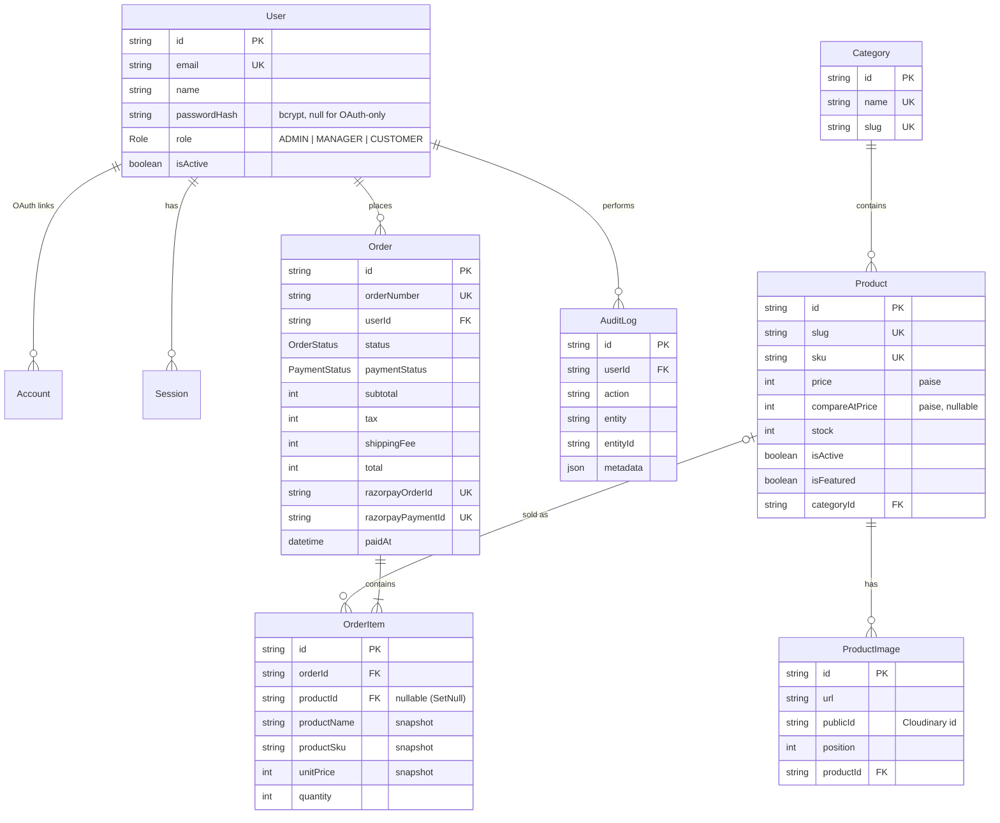

# Database schema

PostgreSQL, managed with Prisma 7. Source of truth: [`prisma/schema.prisma`](../prisma/schema.prisma). SQL: [`prisma/migrations`](../prisma/migrations).

**Conventions**
- IDs are `cuid()` strings.
- **All money is stored as integers in paise** (₹499.00 → `49900`).
- Every table has `createdAt`; mutable tables have `updatedAt`.

## Entity-relationship diagram



Auth.js also uses `Account`, `Session` and `VerificationToken`; password resets use `PasswordResetToken` (hashed token, expiry).

## Enums

| Enum | Values |
|---|---|
| `Role` | `ADMIN`, `MANAGER`, `CUSTOMER` |
| `OrderStatus` | `PENDING` → `PROCESSING` → `SHIPPED` → `DELIVERED`; `CANCELLED` |
| `PaymentStatus` | `PENDING`, `PAID`, `FAILED`, `REFUNDED` |

## Referential actions

| Relation | On delete | Why |
|---|---|---|
| Product → Category | `Restrict` | Can't delete a category that still has products |
| ProductImage → Product | `Cascade` | Images belong to the product |
| OrderItem → Product | `SetNull` | Order history survives product deletion (snapshot fields keep the details) |
| Order → User | `Restrict` | Never lose financial records by deleting a user — deactivate instead |
| Account/Session → User | `Cascade` | Auth data belongs to the user |
| AuditLog → User | `SetNull` | Keep the audit trail |

## Indexes

| Table | Index | Serves |
|---|---|---|
| Product | `(categoryId)`, `(isActive, createdAt)`, `(isFeatured)` | catalog filters, newest sort, home page |
| ProductImage | `(productId, position)` | cover image lookup |
| Order | `(userId, createdAt)` | customer order history |
| Order | `(status)`, `(paymentStatus, createdAt)` | admin filters, revenue analytics |
| OrderItem | `(orderId)`, `(productId)` | order detail, top-products report |
| User | `(role)`, `(createdAt)` | customers list, new-customer KPI |
| AuditLog | `(entity, entityId)`, `(createdAt)` | order activity timeline, audit page |

Unique constraints: `User.email`, `Product.slug`, `Product.sku`, `Category.slug/name`, `Order.orderNumber`, `Order.razorpayOrderId`, `Order.razorpayPaymentId`.

## Migrations workflow

```bash
# change prisma/schema.prisma, then:
npm run db:migrate -- --name describe_change   # dev: creates SQL + applies it
npm run db:deploy                              # prod/CI: applies pending migrations only
```
