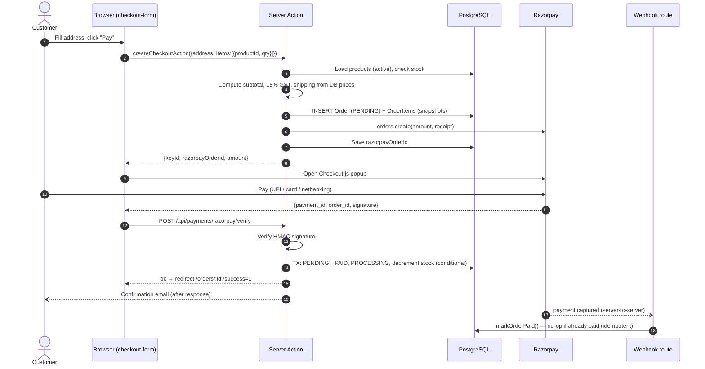
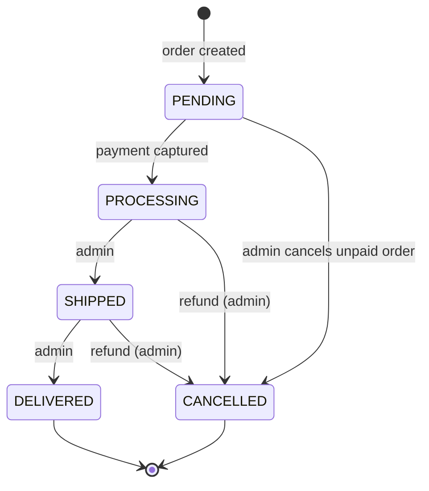
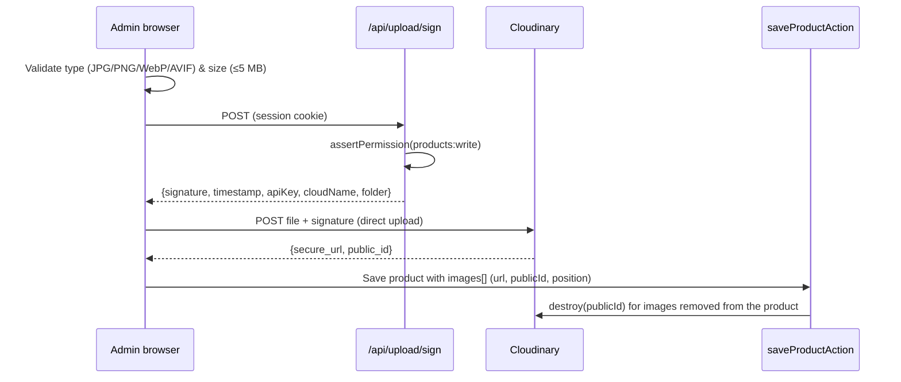
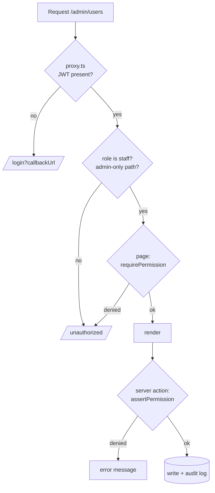

# Workflows

## 1. Checkout & payment

**Why both the callback and the webhook?** The browser callback gives instant feedback; the webhook is the source of truth if the customer closes the tab, loses connection or pays via a delayed UPI flow.

**Development mode:** with no Razorpay keys (and `NODE_ENV !== production`), step 7 onwards is replaced by `simulatePaymentAction`, which calls the same `markOrderPaid` function.

## 2. Order lifecycle

- Transitions are enforced server-side in `actions/orders.ts` (`TRANSITIONS` map); the UI only offers valid next states.
- Only **paid** orders can be fulfilled; a **paid** order can only be cancelled through **Refund & cancel**, which calls the Razorpay Refunds API, sets `paymentStatus = REFUNDED`, restores stock and emails the customer.
- Each transition emails the customer and is written to the audit log (visible as the order's Activity timeline).

## 3. Product image upload

The first image is the cover; images can be reordered. Without Cloudinary, admins paste `https://` image URLs instead.

## 4. Authentication

- **Register** → Zod validation → bcrypt hash (cost 12) → create `CUSTOMER` → welcome email → auto sign-in.
- **Login** → Credentials provider checks hash and `isActive` → JWT cookie with `sub` + `role`.
- **Google** → OAuth → Prisma adapter creates/links the user (email verified by Google).
- **Session refresh** → every 5 min the JWT callback reloads role/active flag; a deactivated user is signed out.
- **Forgot password** → random 32-byte token, SHA-256 hash stored with 1-hour expiry → email link → reset form verifies hash + expiry → new bcrypt hash → all tokens for that email deleted.

## 5. Role-based access

## 6. Analytics & reports

- **Dashboard** (`/admin?range=7d|30d|90d|12m`): KPIs (revenue, paid orders, AOV, new customers) compared with the previous equal-length period; revenue trend bucketed by day/week/month via `date_trunc`; orders by status; sales by category; top products; low stock; recent orders.
- **Reports** (`/admin/reports?from=&to=`): net sales, GST, shipping, refunds, cancellations, top 10 products, daily table, and CSV export of orders or product sales for the same range.
- Revenue counts only `paymentStatus = PAID`, keyed on `paidAt`.
